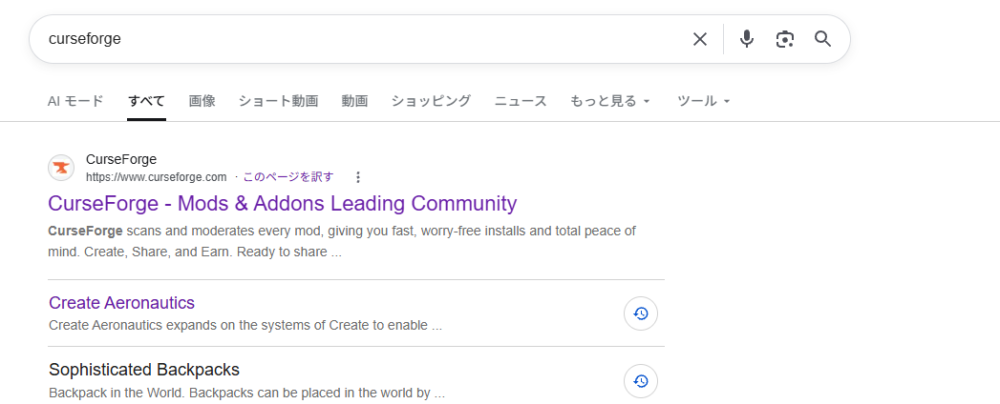

import { Image } from 'astro:assets';
import sc1Image from '../../../assets/SC1.png';

KubeJSスクリプトの開発や動作確認を行うために、まずは基本的なMOD環境を整えます。

## PC環境について

快適な開発・プレイのため、Minecraft Java Editionの推奨動作環境を満たすスペックのPCを用意してください。
（※統合版/Bedrock EditionではKubeJSは動作しません）

---

## CurseForgeのインストール

バニラランチャー（公式ランチャー）でも開発は可能ですが、KubeJS本体、前提ライブラリ、一緒に導入する工業MODやアドオンの更新管理が非常に便利になるため、**CurseForge App** の利用を推奨します。

1. [CurseForge 公式ダウンロードページ](https://www.curseforge.com/download/app) にアクセスします。
2. ページ内の **「More Download Options」** をクリックするか、下部へスクロールします。
3. **「Standalone」版** をダウンロードしてインストールします。

:::note[Standalone版を推奨する理由]
Overwolf同梱版は不要なバックグラウンド機能が多いため、こだわりがなければシンプルな「Standalone」版がおすすめです。
:::

:::tip[バニラランチャーで作業したい場合]
公式ランチャーを使って手動でMODを入れることも可能ですが、フォルダ管理やMODの依存関係チェックをすべて自力で行う必要があります。
:::

---

## 必須・推奨MODのインストール

準備したプロファイル（インスタンス）に、以下の基本MODを導入します。

KubeJSでのレシピ改変や統合開発において、対象となる主要な大型MODと、連携用のKubeJSアドオン（および主要アドオン）の分類リストです。

### KubeJS コア・基本拡張

KubeJS本体および、EntityやUIなどをスクリプトから制御するための基盤拡張です。

* [KubeJS](https://www.curseforge.com/minecraft/mc-mods/kubejs)
* [Rhino](https://www.curseforge.com/minecraft/mc-mods/rhino) (JavaScript実行エンジン)
* [EntityJS](https://www.curseforge.com/minecraft/mc-mods/entityjs) (カスタムエンティティ追加)
* [KubeJS Additions](https://www.curseforge.com/minecraft/mc-mods/kubejs-additions)
* [KubeJS Curios](https://www.curseforge.com/minecraft/mc-mods/kubejs-curios)

---

### Create系

回転力とカラクリを扱う大型工業MOD「Create」とそのKubeJS連携・周辺アドオン群です。

#### コア & KubeJS連携
* [Create](https://www.curseforge.com/minecraft/mc-mods/create)
* [KubeJS Create](https://www.curseforge.com/minecraft/mc-mods/kubejs-create)
* [Create Heat JS](https://www.curseforge.com/minecraft/mc-mods/create-heat-js) (加熱処理のKubeJS制御)

#### Create アドオン群
* [Create Crafts & Additions](https://www.curseforge.com/minecraft/mc-mods/createaddition) (電力連携)
* [Create Ore Excavation](https://www.curseforge.com/minecraft/mc-mods/create-ore-excavation) (採掘機)
* [Create Big Cannons](https://www.curseforge.com/minecraft/mc-mods/create-big-cannons) (大砲)
* [Create Sifting](https://www.curseforge.com/minecraft/mc-mods/create-sifting) (ふるい分け)
* [Create: Connected](https://www.curseforge.com/minecraft/mc-mods/create-connected)
* [Create: Interiors](https://www.curseforge.com/minecraft/mc-mods/interiors)
* [Create: Smart Crafter](https://www.curseforge.com/minecraft/mc-mods/create-smart-crafter)
* [Create Contraption Terminals](https://www.curseforge.com/minecraft/mc-mods/create-contraption-terminals)
* [Create Chunkloading](https://www.curseforge.com/minecraft/mc-mods/create-chunkloading)
* [Create: Liquid Fuel](https://www.curseforge.com/minecraft/mc-mods/create-liquid-fuel)
* [Create: Escalated](https://www.curseforge.com/minecraft/mc-mods/create-escalated)
* [Create Chromatic Return](https://www.curseforge.com/minecraft/mc-mods/create-chromaticreturn)
* [Create: Radars](https://www.curseforge.com/minecraft/mc-mods/create-radars)
* [Create: Easy Structures](https://www.curseforge.com/minecraft/mc-mods/create-easy-structures)

---

### Mekanism系

ハイテク工業MOD「Mekanism」と、そのKubeJS連携および拡張アドオン群です。

#### コア & KubeJS連携
* [Mekanism](https://www.curseforge.com/minecraft/mc-mods/mekanism)
* [KubeJS Mekanism UNOFFICIAL](https://www.curseforge.com/minecraft/mc-mods/kubejs-mekanism-unofficial)

#### Mekanism 公式・各種アドオン
* [Mekanism Generators](https://www.curseforge.com/minecraft/mc-mods/mekanism-generators)
* [Mekanism Tools](https://www.curseforge.com/minecraft/mc-mods/mekanism-tools)
* [Mekanism Extras](https://www.curseforge.com/minecraft/mc-mods/mekanism-extras)
* [Mekanism: More Machine](https://www.curseforge.com/minecraft/mc-mods/mekanism-more-machine)
* [Mekanism: Empowered](https://www.curseforge.com/minecraft/mc-mods/mekanism-empowered) / [Empowered Core](https://www.curseforge.com/minecraft/mc-mods/mekanism-empowered-core)
* [Mekanism Weaponry](https://www.curseforge.com/minecraft/mc-mods/mekanism-weaponry) / [Weapons](https://www.curseforge.com/minecraft/mc-mods/mekanism-weapons)
* [Compact Mekanism Machines](https://www.curseforge.com/minecraft/mc-mods/compact-mekanism-machines)
* [Mekanism Borderless Multiblock](https://www.curseforge.com/minecraft/mc-mods/mekanism-borderless)
* [Just Enough Mekanism Multiblocks](https://www.curseforge.com/minecraft/mc-mods/just-enough-mekanism-multiblocks)
* [Mekanism: Enchantable MekaSuit](https://www.curseforge.com/minecraft/mc-mods/mekanism-enchantable-mekasuit)
* [Mekanism Spectator Module](https://www.curseforge.com/minecraft/mc-mods/mekanism-spectator-module)
* [Mekanism Liquid Radioactive Material](https://www.curseforge.com/minecraft/mc-mods/mekanism-liquid-radioactive-material)
* [Nether & End Mekanism Ores](https://www.curseforge.com/minecraft/mc-mods/nether-end-mekanism-ores)
* [Mekanism: Ad Astra Ores](https://www.curseforge.com/minecraft/mc-mods/mekanism-ad-astra-ores)

---

### Applied Energistics 2 (AE2)系

デジタルストレージMOD「AE2」と拡張パーツ・他MOD連携群です。

#### コア & 拡張
* [Applied Energistics 2](https://www.curseforge.com/minecraft/mc-mods/applied-energistics-2)
* [Applied Energistics 2 Wireless Terminals](https://www.curseforge.com/minecraft/mc-mods/applied-energistics-2-wireless-terminals)
* [AEInfinityBooster](https://www.curseforge.com/minecraft/mc-mods/aeinfinitybooster)
* [ExtendedAE](https://www.curseforge.com/minecraft/mc-mods/ex-pattern-provider)
* [MEGA Cells](https://www.curseforge.com/minecraft/mc-mods/mega-cells) / [AE2 MEGA Things](https://www.curseforge.com/minecraft/mc-mods/ae2-mega-things)
* [AE2 Things](https://www.curseforge.com/minecraft/mc-mods/ae2-things-forge)
* [Applied Mekanistics](https://www.curseforge.com/minecraft/mc-mods/applied-mekanistics) (Mekanismガス・液体対応)
* [AE2: Crafting Tree](https://www.curseforge.com/minecraft/mc-mods/ae2-crafting-tree)
* [AE2 Network Analyser](https://www.curseforge.com/minecraft/mc-mods/ae2-network-analyser)
* [AE2 Import Export Card](https://www.curseforge.com/minecraft/mc-mods/ae2-import-export-card)

---

### コンピュータ・自動化・その他KubeJS対応MOD

* **CC: Tweaked (ComputerCraft)**
  * [CC: Tweaked](https://www.curseforge.com/minecraft/mc-mods/cc-tweaked)
  * [KubeJS + CC: Tweaked](https://www.curseforge.com/minecraft/mc-mods/kubejs-cc)
  * [Advanced Peripherals](https://www.curseforge.com/minecraft/mc-mods/advanced-peripherals)
* **Ender IO**
  * [Ender IO](https://www.curseforge.com/minecraft/mc-mods/ender-io)
  * [KubeJS EnderIO](https://www.curseforge.com/minecraft/mc-mods/kubejs-enderio)
* **Botany Pots (鉢植え)**
  * [Botany Pots](https://www.curseforge.com/minecraft/mc-mods/botany-pots)
  * [KubeJS Botany Pots](https://www.curseforge.com/minecraft/mc-mods/kubejs-botany-pots)
  * [Botany Pots Tiers](https://www.curseforge.com/minecraft/mc-mods/botany-pots-tiers) / [Trees](https://www.curseforge.com/minecraft/mc-mods/botany-trees) / [Ore Planting](https://www.curseforge.com/minecraft/mc-mods/botany-pots-ore-planting)
* **Ars Nouveau (魔法)**
  * [Ars Nouveau](https://www.curseforge.com/minecraft/mc-mods/ars-nouveau)
  * [KubeJS Ars Nouveau](https://www.curseforge.com/minecraft/mc-mods/kubejs-ars-nouveau)

---